# Design Document

## Overview

The API Test Runner is designed as a modular, plugin-based testing framework built in Rust. The architecture emphasizes performance, safety, and extensibility through a combination of trait-based plugin systems, async execution engines, and event-driven communication. The system leverages Rust's type system for compile-time safety while providing runtime flexibility through dynamic plugin loading.

## Architecture

### High-Level Architecture

```mermaid
graph TB
    CLI[CLI Interface] --> Core[Core Engine]
    Config[Configuration Manager] --> Core
    Core --> PluginManager[Plugin Manager]
    Core --> ExecutionEngine[Execution Engine]
    Core --> EventBus[Event Bus]
    Core --> TestCaseManager[Test Case Manager]
    Core --> TemplateManager[Template Manager]
    
    PluginManager --> ProtocolPlugins[Protocol Plugins]
    PluginManager --> AssertionPlugins[Assertion Plugins]
    PluginManager --> DataSourcePlugins[Data Source Plugins]
    PluginManager --> ReporterPlugins[Reporter Plugins]
    PluginManager --> AuthPlugins[Auth Plugins]
    PluginManager --> MonitorPlugins[Monitor Plugins]
    
    ExecutionEngine --> SerialExecutor[Serial Executor]
    ExecutionEngine --> ParallelExecutor[Parallel Executor]
    ExecutionEngine --> DistributedExecutor[Distributed Executor]
    ExecutionEngine --> InteractiveExecutor[Interactive Executor]
    
    TestCaseManager --> StorageBackend[Storage Backend]
    TestCaseManager --> ImportExport[Import/Export System]
    TestCaseManager --> TestCaseIndexer[Test Case Indexer]
    
    TemplateManager --> BuiltinTemplates[Built-in Templates]
    TemplateManager --> CustomTemplates[Custom Templates]
    
    InteractiveExecutor --> TestDebugger[Test Debugger]
    InteractiveExecutor --> VariableInspector[Variable Inspector]
    InteractiveExecutor --> ProgressReporter[Progress Reporter]
    
    EventBus --> EventHandlers[Event Handlers]
    EventBus --> MetricsCollector[Metrics Collector]
```



### Core Components

#### 1. Plugin Manager
- **Dynamic Loading**: Uses `libloading` crate for runtime plugin loading
- **Plugin Registry**: Maintains a registry of loaded plugins with version management
- **Dependency Resolution**: Handles plugin dependencies and loading order
- **Hot Reload**: Supports plugin updates without system restart using file watchers

#### 2. Execution Engine
- **Async Runtime**: Built on `tokio` for high-performance async execution
- **Resource Management**: Controls CPU, memory, and network resource usage
- **Backpressure Handling**: Implements flow control to prevent resource exhaustion
- **Circuit Breaker**: Protects against cascading failures in distributed scenarios

#### 3. Event Bus
- **Publisher-Subscriber**: Implements async event distribution using `tokio::sync::broadcast`
- **Event Filtering**: Supports predicate-based event routing
- **Persistence Layer**: Uses `sled` embedded database for event storage
- **Replay Capability**: Enables event replay for debugging and analysis

#### 4. Test Case Manager
- **CRUD Operations**: Provides create, read, update, delete operations for test cases
- **Storage Abstraction**: Supports multiple storage backends (filesystem, database)
- **Import/Export**: Handles conversion between different test case formats
- **Indexing and Search**: Enables fast search and filtering of test cases

#### 5. Template Manager
- **Template Registry**: Manages built-in and custom test case templates
- **Variable Substitution**: Handles template variable replacement and validation
- **Template Categories**: Organizes templates by protocol and use case
- **Custom Templates**: Supports user-defined templates and sharing

#### 6. Interactive Executor
- **Debug Mode**: Provides step-by-step execution with breakpoints
- **Variable Inspection**: Allows runtime variable examination and modification
- **Progress Monitoring**: Real-time execution progress with cancellation support
- **Dry Run**: Validates test cases without actual execution

## Components and Interfaces

### Plugin System Design

#### Core Plugin Trait
```rust
use async_trait::async_trait;
use serde::{Deserialize, Serialize};
use std::collections::HashMap;

#[async_trait]
pub trait Plugin: Send + Sync {
    fn name(&self) -> &str;
    fn version(&self) -> &str;
    fn dependencies(&self) -> Vec<String>;
    async fn initialize(&mut self, config: &PluginConfig) -> Result<(), PluginError>;
    async fn shutdown(&mut self) -> Result<(), PluginError>;
}

#[derive(Debug, Clone, Serialize, Deserialize)]
pub struct PluginConfig {
    pub settings: HashMap<String, serde_json::Value>,
    pub environment: String,
}
```

#### Protocol Plugin Interface
```rust
#[async_trait]
pub trait ProtocolPlugin: Plugin {
    async fn execute_request(&self, request: ProtocolRequest) -> Result<ProtocolResponse, ProtocolError>;
    async fn validate_connection(&self, config: &ConnectionConfig) -> Result<(), ProtocolError>;
    fn supported_schemes(&self) -> Vec<String>;
    fn supported_versions(&self) -> Vec<ProtocolVersion>;
}

#[derive(Debug, Clone, PartialEq)]
pub enum ProtocolVersion {
    Http1_0,
    Http1_1,
    Http2,
    Http3,
}

#[derive(Debug, Clone)]
pub struct ProtocolRequest {
    pub method: HttpMethod,
    pub url: String,
    pub headers: HashMap<String, String>,
    pub body: Option<Vec<u8>>,
    pub timeout: Duration,
    pub protocol_version: Option<ProtocolVersion>,
    pub tls_config: Option<TlsConfig>,
}

#[derive(Debug, Clone, PartialEq)]
pub enum HttpMethod {
    GET,
    POST,
    PUT,
    DELETE,
    PATCH,
    HEAD,
    OPTIONS,
    TRACE,
    CONNECT,
}

#[derive(Debug, Clone)]
pub struct TlsConfig {
    pub verify_certificates: bool,
    pub client_cert: Option<ClientCertificate>,
    pub ca_certificates: Vec<Certificate>,
    pub min_tls_version: TlsVersion,
    pub max_tls_version: TlsVersion,
}

#[derive(Debug, Clone)]
pub enum TlsVersion {
    Tls1_0,
    Tls1_1,
    Tls1_2,
    Tls1_3,
}

#[derive(Debug, Clone)]
pub struct ProtocolResponse {
    pub status_code: u16,
    pub headers: HashMap<String, String>,
    pub body: Vec<u8>,
    pub duration: Duration,
    pub metadata: HashMap<String, String>,
}
```

#### Assertion Plugin Interface
```rust
#[async_trait]
pub trait AssertionPlugin: Plugin {
    fn assertion_type(&self) -> AssertionType;
    async fn execute(&self, actual: &ResponseData, expected: &ExpectedValue) -> AssertionResult;
    fn priority(&self) -> u8;
}

#[derive(Debug, Clone)]
pub enum AssertionType {
    StatusCode,
    Header,
    JsonPath,
    XPath,
    ResponseTime,
    Custom(String),
}

#[derive(Debug)]
pub struct AssertionResult {
    pub success: bool,
    pub message: String,
    pub actual_value: Option<serde_json::Value>,
    pub expected_value: Option<serde_json::Value>,
}
```

### Execution Engine Design

#### Execution Context
```rust
#[derive(Debug, Clone)]
pub struct ExecutionContext {
    pub test_suite_id: String,
    pub environment: String,
    pub variables: HashMap<String, String>,
    pub auth_tokens: HashMap<String, AuthToken>,
    pub metrics: Arc<MetricsCollector>,
}

#[async_trait]
pub trait ExecutionStrategy: Send + Sync {
    async fn execute(&self, 
        test_cases: Vec<TestCase>, 
        context: ExecutionContext
    ) -> Result<ExecutionResult, ExecutionError>;
}
```

#### Serial Execution Strategy
```rust
pub struct SerialExecutor {
    event_bus: Arc<EventBus>,
}

impl SerialExecutor {
    async fn execute_with_state_propagation(&self, 
        test_cases: Vec<TestCase>, 
        mut context: ExecutionContext
    ) -> Result<ExecutionResult, ExecutionError> {
        let mut results = Vec::new();
        
        for test_case in test_cases {
            // Execute test case and update context with extracted variables
            let result = self.execute_single_test(&test_case, &context).await?;
            
            // Extract variables for next test
            if let Some(extractions) = &test_case.variable_extractions {
                for extraction in extractions {
                    if let Some(value) = self.extract_variable(&result.response, extraction) {
                        context.variables.insert(extraction.name.clone(), value);
                    }
                }
            }
            
            results.push(result);
        }
        
        Ok(ExecutionResult { test_results: results })
    }
}
```

#### Parallel Execution Strategy
```rust
pub struct ParallelExecutor {
    concurrency_limit: usize,
    rate_limiter: Arc<RateLimiter>,
}

impl ParallelExecutor {
    async fn execute_with_concurrency_control(&self, 
        test_cases: Vec<TestCase>, 
        context: ExecutionContext
    ) -> Result<ExecutionResult, ExecutionError> {
        let semaphore = Arc::new(Semaphore::new(self.concurrency_limit));
        let mut tasks = Vec::new();
        
        for test_case in test_cases {
            let permit = semaphore.clone().acquire_owned().await?;
            let context_clone = context.clone();
            let rate_limiter = self.rate_limiter.clone();
            
            let task = tokio::spawn(async move {
                let _permit = permit; // Hold permit until task completes
                rate_limiter.wait().await;
                self.execute_single_test(&test_case, &context_clone).await
            });
            
            tasks.push(task);
        }
        
        let results = futures::future::try_join_all(tasks).await?;
        Ok(ExecutionResult { test_results: results })
    }
}
```

### Test Case Management System

#### Test Case Storage and Organization
```rust
#[derive(Debug, Clone, Serialize, Deserialize)]
pub struct TestCaseRepository {
    storage_backend: Box<dyn StorageBackend>,
    indexer: TestCaseIndexer,
    validator: TestCaseValidator,
}

#[async_trait]
pub trait StorageBackend: Send + Sync {
    async fn create_test_case(&self, test_case: &TestCase) -> Result<String, StorageError>;
    async fn read_test_case(&self, id: &str) -> Result<TestCase, StorageError>;
    async fn update_test_case(&self, id: &str, test_case: &TestCase) -> Result<(), StorageError>;
    async fn delete_test_case(&self, id: &str) -> Result<(), StorageError>;
    async fn list_test_cases(&self, filter: &TestCaseFilter) -> Result<Vec<TestCaseMetadata>, StorageError>;
}

// File-based storage implementation
pub struct FileSystemStorage {
    base_path: PathBuf,
    format: TestCaseFormat,
}

#[derive(Debug, Clone)]
pub enum TestCaseFormat {
    Yaml,
    Json,
}

#[derive(Debug, Clone, Serialize, Deserialize)]
pub struct TestCaseMetadata {
    pub id: String,
    pub name: String,
    pub description: Option<String>,
    pub tags: Vec<String>,
    pub protocol: String,
    pub created_at: DateTime<Utc>,
    pub updated_at: DateTime<Utc>,
    pub version: u32,
}
```

#### Test Case Import/Export System
```rust
#[async_trait]
pub trait TestCaseImporter: Send + Sync {
    fn supported_formats(&self) -> Vec<ImportFormat>;
    async fn import(&self, source: &ImportSource) -> Result<Vec<TestCase>, ImportError>;
    fn validate_source(&self, source: &ImportSource) -> Result<(), ImportError>;
}

#[derive(Debug, Clone)]
pub enum ImportFormat {
    PostmanCollection,
    OpenApiSpec,
    InsomniaCollection,
    SwaggerSpec,
}

#[derive(Debug, Clone)]
pub enum ImportSource {
    File(PathBuf),
    Url(String),
    Content(String),
}

// Postman collection importer
pub struct PostmanImporter {
    variable_resolver: VariableResolver,
    auth_converter: AuthConverter,
}

impl PostmanImporter {
    async fn convert_postman_request(&self, postman_request: &PostmanRequest) -> Result<TestCase, ImportError> {
        let request = RequestDefinition {
            protocol: "http".to_string(),
            method: postman_request.method.clone(),
            url: self.resolve_variables(&postman_request.url)?,
            headers: self.convert_headers(&postman_request.header)?,
            body: self.convert_body(&postman_request.body)?,
            auth: self.convert_auth(&postman_request.auth)?,
        };
        
        let assertions = self.convert_postman_tests(&postman_request.event)?;
        
        Ok(TestCase {
            id: Uuid::new_v4().to_string(),
            name: postman_request.name.clone(),
            description: postman_request.description.clone(),
            request,
            assertions,
            variable_extractions: None,
            dependencies: vec![],
            timeout: None,
        })
    }
}
```

#### Interactive Execution Engine
```rust
pub struct InteractiveExecutor {
    execution_engine: Arc<ExecutionEngine>,
    debugger: TestDebugger,
    variable_inspector: VariableInspector,
    progress_reporter: ProgressReporter,
}

impl InteractiveExecutor {
    pub async fn execute_single_with_debugging(&self, 
        test_case: &TestCase, 
        context: &ExecutionContext,
        debug_options: DebugOptions
    ) -> Result<InteractiveExecutionResult, ExecutionError> {
        let mut result = InteractiveExecutionResult::new();
        
        // Pre-execution validation
        if debug_options.dry_run {
            return self.validate_test_case(test_case, context).await;
        }
        
        // Step-by-step execution with breakpoints
        for (step_index, step) in test_case.execution_steps().enumerate() {
            if debug_options.breakpoints.contains(&step_index) {
                self.wait_for_user_input(&format!("Breakpoint at step {}: {}", step_index, step.name)).await?;
            }
            
            let step_result = self.execute_step_with_inspection(step, context, &debug_options).await?;
            result.add_step_result(step_result);
            
            // Variable inspection after each step
            if debug_options.inspect_variables {
                let variables = self.variable_inspector.inspect_context(context).await?;
                result.add_variable_snapshot(step_index, variables);
            }
        }
        
        Ok(result)
    }
    
    async fn execute_step_with_inspection(&self, 
        step: &ExecutionStep, 
        context: &ExecutionContext,
        debug_options: &DebugOptions
    ) -> Result<StepExecutionResult, ExecutionError> {
        let start_time = Instant::now();
        
        // Log request details if verbose
        if debug_options.verbose {
            self.log_request_details(&step.request).await;
        }
        
        let response = self.execution_engine.execute_request(&step.request, context).await?;
        let duration = start_time.elapsed();
        
        // Log response details if verbose
        if debug_options.verbose {
            self.log_response_details(&response).await;
        }
        
        Ok(StepExecutionResult {
            step_name: step.name.clone(),
            request: step.request.clone(),
            response,
            duration,
            variables_extracted: self.extract_variables(&step.variable_extractions, &response)?,
        })
    }
}

#[derive(Debug, Clone)]
pub struct DebugOptions {
    pub dry_run: bool,
    pub verbose: bool,
    pub inspect_variables: bool,
    pub breakpoints: HashSet<usize>,
    pub step_through: bool,
}

#[derive(Debug)]
pub struct InteractiveExecutionResult {
    pub step_results: Vec<StepExecutionResult>,
    pub variable_snapshots: HashMap<usize, HashMap<String, String>>,
    pub total_duration: Duration,
    pub success: bool,
}
```

#### Real-time Progress Monitoring
```rust
pub struct ProgressReporter {
    event_bus: Arc<EventBus>,
    progress_subscribers: Arc<Mutex<Vec<ProgressSubscriber>>>,
}

#[async_trait]
pub trait ProgressSubscriber: Send + Sync {
    async fn on_progress_update(&self, update: ProgressUpdate) -> Result<(), ProgressError>;
    async fn on_execution_complete(&self, result: ExecutionSummary) -> Result<(), ProgressError>;
}

#[derive(Debug, Clone, Serialize)]
pub struct ProgressUpdate {
    pub execution_id: String,
    pub current_step: usize,
    pub total_steps: usize,
    pub current_test_case: String,
    pub elapsed_time: Duration,
    pub estimated_remaining: Option<Duration>,
    pub success_count: usize,
    pub failure_count: usize,
}

// Console progress subscriber for CLI
pub struct ConsoleProgressSubscriber {
    progress_bar: ProgressBar,
}

impl ConsoleProgressSubscriber {
    pub fn new() -> Self {
        let progress_bar = ProgressBar::new(100);
        progress_bar.set_style(
            ProgressStyle::default_bar()
                .template("{spinner:.green} [{elapsed_precise}] [{bar:40.cyan/blue}] {pos}/{len} {msg}")
                .progress_chars("#>-")
        );
        
        Self { progress_bar }
    }
}

#[async_trait]
impl ProgressSubscriber for ConsoleProgressSubscriber {
    async fn on_progress_update(&self, update: ProgressUpdate) -> Result<(), ProgressError> {
        self.progress_bar.set_length(update.total_steps as u64);
        self.progress_bar.set_position(update.current_step as u64);
        self.progress_bar.set_message(format!(
            "Executing: {} | ✓{} ✗{}", 
            update.current_test_case, 
            update.success_count, 
            update.failure_count
        ));
        Ok(())
    }
    
    async fn on_execution_complete(&self, result: ExecutionSummary) -> Result<(), ProgressError> {
        self.progress_bar.finish_with_message(format!(
            "Completed: {} tests, {} passed, {} failed in {:?}",
            result.total_tests,
            result.passed_tests,
            result.failed_tests,
            result.total_duration
        ));
        Ok(())
    }
}
```

#### Test Case Template System
```rust
pub struct TestCaseTemplateManager {
    template_registry: HashMap<String, TestCaseTemplate>,
    custom_templates_path: PathBuf,
}

#[derive(Debug, Clone, Serialize, Deserialize)]
pub struct TestCaseTemplate {
    pub id: String,
    pub name: String,
    pub description: String,
    pub category: TemplateCategory,
    pub template: TestCaseDefinition,
    pub variables: Vec<TemplateVariable>,
    pub instructions: Option<String>,
}

#[derive(Debug, Clone, Serialize, Deserialize)]
pub enum TemplateCategory {
    RestApi,
    GraphQL,
    Authentication,
    DataValidation,
    Performance,
    Integration,
    Custom(String),
}

#[derive(Debug, Clone, Serialize, Deserialize)]
pub struct TemplateVariable {
    pub name: String,
    pub description: String,
    pub variable_type: VariableType,
    pub default_value: Option<String>,
    pub required: bool,
    pub validation_pattern: Option<String>,
}

#[derive(Debug, Clone, Serialize, Deserialize)]
pub enum VariableType {
    String,
    Number,
    Boolean,
    Url,
    Email,
    Json,
}

impl TestCaseTemplateManager {
    pub fn new() -> Self {
        let mut manager = Self {
            template_registry: HashMap::new(),
            custom_templates_path: PathBuf::from("templates"),
        };
        
        manager.register_builtin_templates();
        manager
    }
    
    fn register_builtin_templates(&mut self) {
        // REST API GET template
        let get_template = TestCaseTemplate {
            id: "rest-api-get".to_string(),
            name: "REST API GET Request".to_string(),
            description: "Basic GET request template for REST APIs".to_string(),
            category: TemplateCategory::RestApi,
            template: TestCaseDefinition {
                request: RequestDefinition {
                    protocol: "http".to_string(),
                    method: "GET".to_string(),
                    url: "{{base_url}}/{{endpoint}}".to_string(),
                    headers: HashMap::from([
                        ("Accept".to_string(), "application/json".to_string()),
                        ("User-Agent".to_string(), "API-Test-Runner/1.0".to_string()),
                    ]),
                    body: None,
                    auth: None,
                },
                assertions: vec![
                    AssertionDefinition {
                        assertion_type: "status_code".to_string(),
                        expected: json!(200),
                        message: Some("Response should be successful".to_string()),
                    },
                    AssertionDefinition {
                        assertion_type: "response_time".to_string(),
                        expected: json!(1000),
                        message: Some("Response should be under 1 second".to_string()),
                    },
                ],
            },
            variables: vec![
                TemplateVariable {
                    name: "base_url".to_string(),
                    description: "Base URL of the API".to_string(),
                    variable_type: VariableType::Url,
                    default_value: Some("https://api.example.com".to_string()),
                    required: true,
                    validation_pattern: Some(r"^https?://.*".to_string()),
                },
                TemplateVariable {
                    name: "endpoint".to_string(),
                    description: "API endpoint path".to_string(),
                    variable_type: VariableType::String,
                    default_value: Some("users".to_string()),
                    required: true,
                    validation_pattern: None,
                },
            ],
            instructions: Some("This template creates a basic GET request. Fill in the base_url and endpoint variables.".to_string()),
        };
        
        self.template_registry.insert(get_template.id.clone(), get_template);
        
        // Add more built-in templates...
        self.register_post_template();
        self.register_auth_template();
        self.register_validation_template();
    }
    
    pub async fn create_from_template(&self, 
        template_id: &str, 
        variables: HashMap<String, String>
    ) -> Result<TestCase, TemplateError> {
        let template = self.template_registry.get(template_id)
            .ok_or_else(|| TemplateError::TemplateNotFound(template_id.to_string()))?;
            
        // Validate required variables
        for template_var in &template.variables {
            if template_var.required && !variables.contains_key(&template_var.name) {
                return Err(TemplateError::MissingRequiredVariable(template_var.name.clone()));
            }
        }
        
        // Substitute variables in template
        let mut test_case_json = serde_json::to_string(&template.template)?;
        for (var_name, var_value) in &variables {
            test_case_json = test_case_json.replace(&format!("{{{{{}}}}}", var_name), var_value);
        }
        
        let test_case_def: TestCaseDefinition = serde_json::from_str(&test_case_json)?;
        
        Ok(TestCase {
            id: Uuid::new_v4().to_string(),
            name: format!("Generated from {}", template.name),
            description: Some(template.description.clone()),
            request: test_case_def.request,
            assertions: test_case_def.assertions,
            variable_extractions: None,
            dependencies: vec![],
            timeout: None,
        })
    }
}
```

### Built-in REST API Plugin

#### HTTP Client Implementation
```rust
pub struct RestApiPlugin {
    client: Arc<HttpClient>,
    connection_pool: Arc<ConnectionPool>,
}

impl RestApiPlugin {
    pub fn new() -> Self {
        let client = HttpClient::builder()
            .pool_max_idle_per_host(10)
            .pool_idle_timeout(Duration::from_secs(30))
            .timeout(Duration::from_secs(30))
            .build()
            .expect("Failed to create HTTP client");
            
        Self {
            client: Arc::new(client),
            connection_pool: Arc::new(ConnectionPool::new()),
        }
    }
    
    async fn execute_http_request(&self, request: &ProtocolRequest) -> Result<ProtocolResponse, ProtocolError> {
        let mut req_builder = self.client
            .request(request.method.clone(), &request.url)
            .timeout(request.timeout);
            
        // Set HTTP version if specified
        if let Some(version) = &request.protocol_version {
            req_builder = req_builder.version(version.into());
        }
        
        // Configure TLS if HTTPS
        if request.url.starts_with("https://") {
            if let Some(tls_config) = &request.tls_config {
                req_builder = self.configure_tls(req_builder, tls_config)?;
            }
        }
        
        // Add headers
        for (key, value) in &request.headers {
            req_builder = req_builder.header(key, value);
        }
        
        // Add body if present
        if let Some(body) = &request.body {
            req_builder = req_builder.body(body.clone());
        }
        
        let start_time = Instant::now();
        let response = req_builder.send().await?;
        let duration = start_time.elapsed();
        
        Ok(ProtocolResponse {
            status_code: response.status().as_u16(),
            headers: self.extract_headers(&response),
            body: response.bytes().await?.to_vec(),
            duration,
            metadata: self.extract_metadata(&response),
        })
    }
    
    fn configure_tls(&self, builder: RequestBuilder, tls_config: &TlsConfig) -> Result<RequestBuilder, ProtocolError> {
        let mut tls_builder = builder
            .danger_accept_invalid_certs(!tls_config.verify_certificates);
            
        // Configure TLS version range
        tls_builder = tls_builder
            .min_tls_version(tls_config.min_tls_version.into())
            .max_tls_version(tls_config.max_tls_version.into());
            
        // Add client certificate if provided
        if let Some(client_cert) = &tls_config.client_cert {
            tls_builder = tls_builder.identity(client_cert.into());
        }
        
        // Add CA certificates
        for ca_cert in &tls_config.ca_certificates {
            tls_builder = tls_builder.add_root_certificate(ca_cert.into());
        }
        
        Ok(tls_builder)
    }
}

#[async_trait]
impl ProtocolPlugin for RestApiPlugin {
    async fn execute_request(&self, request: ProtocolRequest) -> Result<ProtocolResponse, ProtocolError> {
        self.execute_http_request(&request).await
    }
    
    async fn validate_connection(&self, config: &ConnectionConfig) -> Result<(), ProtocolError> {
        // Perform a HEAD request to validate connectivity
        let test_request = ProtocolRequest {
            method: HttpMethod::HEAD,
            url: config.base_url.clone(),
            headers: HashMap::new(),
            body: None,
            timeout: Duration::from_secs(5),
            protocol_version: config.preferred_version.clone(),
            tls_config: config.tls_config.clone(),
        };
        
        self.execute_request(test_request).await?;
        Ok(())
    }
    
    fn supported_schemes(&self) -> Vec<String> {
        vec!["http".to_string(), "https".to_string()]
    }
    
    fn supported_versions(&self) -> Vec<ProtocolVersion> {
        vec![
            ProtocolVersion::Http1_0,
            ProtocolVersion::Http1_1,
            ProtocolVersion::Http2,
            // HTTP/3 support can be added when the ecosystem matures
        ]
    }
}

impl Plugin for RestApiPlugin {
    fn name(&self) -> &str {
        "rest-api"
    }
    
    fn version(&self) -> &str {
        "1.0.0"
    }
    
    fn dependencies(&self) -> Vec<String> {
        vec![]
    }
    
    async fn initialize(&mut self, config: &PluginConfig) -> Result<(), PluginError> {
        // Initialize connection pools, configure default timeouts, etc.
        Ok(())
    }
    
    async fn shutdown(&mut self) -> Result<(), PluginError> {
        // Clean up connections and resources
        Ok(())
    }
}
```

#### HTTP-Specific Configuration
```rust
#[derive(Debug, Clone, Serialize, Deserialize)]
pub struct ConnectionConfig {
    pub base_url: String,
    pub preferred_version: Option<ProtocolVersion>,
    pub tls_config: Option<TlsConfig>,
    pub connection_pool_size: Option<usize>,
    pub keep_alive_timeout: Option<Duration>,
    pub follow_redirects: bool,
    pub max_redirects: u32,
}

#[derive(Debug, Clone)]
pub struct ClientCertificate {
    pub cert_pem: Vec<u8>,
    pub key_pem: Vec<u8>,
    pub password: Option<String>,
}

#[derive(Debug, Clone)]
pub struct Certificate {
    pub pem_data: Vec<u8>,
}
```

#### REST-Specific Assertions
```rust
pub struct HttpStatusAssertion;

#[async_trait]
impl AssertionPlugin for HttpStatusAssertion {
    fn assertion_type(&self) -> AssertionType {
        AssertionType::StatusCode
    }
    
    async fn execute(&self, actual: &ResponseData, expected: &ExpectedValue) -> AssertionResult {
        let actual_status = actual.status_code;
        
        match expected {
            ExpectedValue::Exact(status) => {
                let expected_status = status.as_u64().unwrap() as u16;
                AssertionResult {
                    success: actual_status == expected_status,
                    message: format!("Expected status {}, got {}", expected_status, actual_status),
                    actual_value: Some(json!(actual_status)),
                    expected_value: Some(json!(expected_status)),
                }
            }
            ExpectedValue::Range(min, max) => {
                let min_status = min.as_u64().unwrap() as u16;
                let max_status = max.as_u64().unwrap() as u16;
                let in_range = actual_status >= min_status && actual_status <= max_status;
                
                AssertionResult {
                    success: in_range,
                    message: format!("Expected status in range {}-{}, got {}", min_status, max_status, actual_status),
                    actual_value: Some(json!(actual_status)),
                    expected_value: Some(json!(format!("{}-{}", min_status, max_status))),
                }
            }
        }
    }
    
    fn priority(&self) -> u8 {
        100 // High priority for basic HTTP validation
    }
}

pub struct HttpHeaderAssertion;

#[async_trait]
impl AssertionPlugin for HttpHeaderAssertion {
    fn assertion_type(&self) -> AssertionType {
        AssertionType::Header
    }
    
    async fn execute(&self, actual: &ResponseData, expected: &ExpectedValue) -> AssertionResult {
        // Implementation for header validation
        // Supports existence checks, value matching, pattern matching
        todo!("Implement header assertion logic")
    }
    
    fn priority(&self) -> u8 {
        90
    }
}
```

### Data Source Integration

#### Data Source Plugin Interface
```rust
#[async_trait]
pub trait DataSourcePlugin: Plugin {
    async fn connect(&mut self) -> Result<(), DataSourceError>;
    async fn next_batch(&self, size: usize) -> Result<Vec<TestData>, DataSourceError>;
    async fn has_more(&self) -> bool;
    async fn reset(&mut self) -> Result<(), DataSourceError>;
}

#[derive(Debug, Clone)]
pub struct TestData {
    pub fields: HashMap<String, serde_json::Value>,
    pub metadata: HashMap<String, String>,
}
```

#### Data Transformation Pipeline
```rust
pub struct DataTransformationPipeline {
    stages: Vec<Box<dyn TransformationStage>>,
}

#[async_trait]
pub trait TransformationStage: Send + Sync {
    async fn transform(&self, data: TestData) -> Result<TestData, TransformationError>;
    fn name(&self) -> &str;
}

// Built-in transformations
pub struct FieldMappingTransform {
    mappings: HashMap<String, String>,
}

pub struct ValueSubstitutionTransform {
    substitutions: HashMap<String, String>,
}

pub struct TypeConversionTransform {
    conversions: HashMap<String, DataType>,
}
```

## Data Models

### Core Test Models
```rust
#[derive(Debug, Clone, Serialize, Deserialize)]
pub struct TestSuite {
    pub id: String,
    pub name: String,
    pub description: Option<String>,
    pub test_cases: Vec<TestCase>,
    pub setup: Option<TestSetup>,
    pub teardown: Option<TestTeardown>,
    pub configuration: TestConfiguration,
}

#[derive(Debug, Clone, Serialize, Deserialize)]
pub struct TestCase {
    pub id: String,
    pub name: String,
    pub description: Option<String>,
    pub request: RequestDefinition,
    pub assertions: Vec<AssertionDefinition>,
    pub variable_extractions: Option<Vec<VariableExtraction>>,
    pub dependencies: Vec<String>,
    pub timeout: Option<Duration>,
}

#[derive(Debug, Clone, Serialize, Deserialize)]
pub struct RequestDefinition {
    pub protocol: String,
    pub method: String,
    pub url: String,
    pub headers: HashMap<String, String>,
    pub body: Option<RequestBody>,
    pub auth: Option<AuthConfig>,
}

#[derive(Debug, Clone, Serialize, Deserialize)]
pub enum RequestBody {
    Text(String),
    Json(serde_json::Value),
    Binary(Vec<u8>),
    Form(HashMap<String, String>),
}
```

### Configuration Models
```rust
#[derive(Debug, Clone, Serialize, Deserialize)]
pub struct TestConfiguration {
    pub execution_mode: ExecutionMode,
    pub concurrency: Option<usize>,
    pub rate_limit: Option<f64>,
    pub timeout: Duration,
    pub retry_policy: RetryPolicy,
    pub data_sources: Vec<DataSourceConfig>,
    pub reporters: Vec<ReporterConfig>,
}

#[derive(Debug, Clone, Serialize, Deserialize)]
pub enum ExecutionMode {
    Serial,
    Parallel { max_concurrency: usize },
    Distributed { nodes: Vec<String> },
}

#[derive(Debug, Clone, Serialize, Deserialize)]
pub struct RetryPolicy {
    pub max_attempts: u32,
    pub backoff_strategy: BackoffStrategy,
    pub retry_conditions: Vec<RetryCondition>,
}
```

## Error Handling

### Error Hierarchy
```rust
#[derive(Debug, thiserror::Error)]
pub enum ApiTestRunnerError {
    #[error("Plugin error: {0}")]
    Plugin(#[from] PluginError),
    
    #[error("Execution error: {0}")]
    Execution(#[from] ExecutionError),
    
    #[error("Configuration error: {0}")]
    Configuration(#[from] ConfigurationError),
    
    #[error("Data source error: {0}")]
    DataSource(#[from] DataSourceError),
    
    #[error("Network error: {0}")]
    Network(#[from] NetworkError),
}

#[derive(Debug, thiserror::Error)]
pub enum PluginError {
    #[error("Plugin not found: {name}")]
    NotFound { name: String },
    
    #[error("Plugin initialization failed: {reason}")]
    InitializationFailed { reason: String },
    
    #[error("Plugin dependency not satisfied: {dependency}")]
    DependencyNotSatisfied { dependency: String },
}
```

### Circuit Breaker Implementation
```rust
pub struct CircuitBreaker {
    state: Arc<Mutex<CircuitBreakerState>>,
    failure_threshold: u32,
    recovery_timeout: Duration,
}

#[derive(Debug)]
enum CircuitBreakerState {
    Closed { failure_count: u32 },
    Open { opened_at: Instant },
    HalfOpen,
}

impl CircuitBreaker {
    pub async fn call<F, T, E>(&self, operation: F) -> Result<T, CircuitBreakerError<E>>
    where
        F: Future<Output = Result<T, E>>,
    {
        match self.current_state().await {
            CircuitBreakerState::Open { .. } => Err(CircuitBreakerError::Open),
            _ => {
                match operation.await {
                    Ok(result) => {
                        self.record_success().await;
                        Ok(result)
                    }
                    Err(error) => {
                        self.record_failure().await;
                        Err(CircuitBreakerError::Execution(error))
                    }
                }
            }
        }
    }
}
```

## Testing Strategy

### Unit Testing Approach
- **Plugin Testing**: Mock plugin interfaces for isolated testing
- **Execution Engine Testing**: Test different execution strategies with controlled scenarios
- **Event Bus Testing**: Verify event publishing, filtering, and persistence
- **Configuration Testing**: Validate configuration parsing and inheritance

### Integration Testing Strategy
- **Plugin Integration**: Test real plugin loading and execution
- **End-to-End Workflows**: Test complete test suite execution with multiple plugins
- **Performance Testing**: Benchmark execution strategies under load
- **Distributed Testing**: Test distributed execution with simulated network partitions

### Test Data Management
```rust
pub struct TestDataBuilder {
    test_cases: Vec<TestCase>,
    data_sources: Vec<Box<dyn DataSourcePlugin>>,
}

impl TestDataBuilder {
    pub fn with_mock_responses(mut self, responses: Vec<MockResponse>) -> Self {
        // Configure mock HTTP responses for testing
        self
    }
    
    pub fn with_test_data(mut self, data: Vec<TestData>) -> Self {
        // Provide static test data
        self
    }
}
```

### Performance Benchmarks
- **Plugin Loading Time**: Measure plugin initialization overhead
- **Request Throughput**: Benchmark requests per second under different concurrency levels
- **Memory Usage**: Monitor memory consumption during large test suite execution
- **Event Processing Latency**: Measure event bus performance under high load

The design emphasizes modularity, performance, and safety while providing the flexibility needed for comprehensive API testing across different protocols and environments.