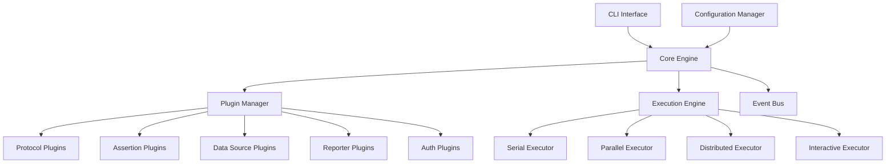

# API Test Runner Documentation

Welcome to the comprehensive documentation for the API Test Runner - a powerful, plugin-based testing framework built in Rust for testing APIs and distributed systems.

## Documentation Structure

### 📚 API Documentation
Complete reference for all plugin interfaces and core components:
- [Plugin Interfaces](api/plugin-interfaces.md) - Core plugin system
- [Protocol Plugins](api/protocol-plugins.md) - HTTP, GraphQL, gRPC support
- [Assertion Plugins](api/assertion-plugins.md) - Response validation
- [Data Source Plugins](api/data-source-plugins.md) - Test data management
- [Authentication Plugins](api/auth-plugins.md) - Authentication mechanisms
- [Reporter Plugins](api/reporter-plugins.md) - Test reporting
- [Core Components](api/core-components.md) - System architecture
- [Event System](api/event-system.md) - Event-driven architecture
- [Execution Engine](api/execution-engine.md) - Test execution strategies

### 📖 User Guides
Step-by-step guides for using the API Test Runner:
- [User Guide](guides/user-guide.md) - Complete user manual
- [Plugin Development Guide](guides/plugin-development.md) - Creating custom plugins
- [Configuration Guide](guides/configuration.md) - System configuration
- [Best Practices](guides/best-practices.md) - Recommended patterns

### 💡 Examples
Practical examples for common use cases:
- [Basic Examples](examples/basic/) - Simple REST API tests
- [Data-Driven Testing](examples/data-driven/) - Using external data sources
- [Advanced Assertions](examples/assertions/) - Complex validation scenarios
- [Workflow Testing](examples/workflows/) - Multi-step test scenarios
- [Performance Testing](examples/performance/) - Load and stress testing
- [Plugin Examples](examples/plugins/) - Custom plugin implementations

### 🔧 Reference
Quick reference materials:
- [CLI Reference](reference/cli.md) - Command-line interface
- [Configuration Reference](reference/configuration.md) - All configuration options
- [Error Codes](reference/error-codes.md) - Error handling reference
- [Troubleshooting](reference/troubleshooting.md) - Common issues and solutions

## Quick Start

### Installation
```bash
# Download the latest release
curl -L https://github.com/api-test-runner/releases/latest/download/api-test-runner-linux.tar.gz | tar xz

# Make it executable
chmod +x api-test-runner

# Move to PATH
sudo mv api-test-runner /usr/local/bin/
```

### Your First Test
```bash
# Initialize a new project
api-test-runner init my-api-tests
cd my-api-tests

# Create a test from template
api-test-runner create-test --name "Get Users" --template rest-api-get

# Run the test
api-test-runner run tests/get-users.yaml
```

## Key Features

### 🔌 Plugin Architecture
- **Extensible**: Add support for new protocols, assertions, and data sources
- **Dynamic Loading**: Load plugins at runtime without recompilation
- **Type Safe**: Rust's type system ensures plugin safety and reliability

### 🚀 Multiple Execution Modes
- **Serial**: Execute tests sequentially with state propagation
- **Parallel**: Run tests concurrently with configurable concurrency
- **Distributed**: Scale across multiple nodes for large test suites
- **Interactive**: Debug tests with step-by-step execution

### 📊 Data-Driven Testing
- **Multiple Sources**: CSV, JSON, YAML, databases, APIs
- **Transformations**: Built-in data transformation pipeline
- **Streaming**: Handle large datasets efficiently

### ✅ Advanced Assertions
- **Multi-Level**: HTTP, JSON, XML, database, message queue validations
- **JSONPath/XPath**: Powerful path-based assertions
- **Schema Validation**: JSON Schema and XML Schema support
- **Custom Logic**: Implement business-specific validation rules

### 🔐 Authentication Support
- **Multiple Methods**: OAuth 2.0, JWT, Basic Auth, API Keys
- **Token Management**: Automatic token refresh and validation
- **Chaining**: Combine multiple authentication methods
- **Custom Plugins**: Implement enterprise-specific auth mechanisms

### 📈 Comprehensive Reporting
- **Multiple Formats**: JUnit XML, HTML, JSON, custom templates
- **Real-time Monitoring**: Live progress updates and metrics
- **Performance Metrics**: Response times, throughput, percentiles
- **Integration Ready**: CI/CD pipeline integration

### ⚡ High Performance
- **Async Runtime**: Built on Tokio for high concurrency
- **Connection Pooling**: Efficient resource management
- **Rate Limiting**: Prevent overwhelming target systems
- **Resource Monitoring**: Track CPU, memory, and network usage

## Architecture Overview



## Community and Support

### 🤝 Contributing
We welcome contributions! Please see our [Contributing Guide](../CONTRIBUTING.md) for details on:
- Code contributions
- Documentation improvements
- Bug reports and feature requests
- Plugin development

### 💬 Getting Help
- **Documentation**: Start with this documentation
- **GitHub Issues**: Report bugs and request features
- **Discussions**: Join community discussions
- **Examples**: Check the examples directory

### 📝 License
This project is licensed under the MIT License - see the [LICENSE](../LICENSE) file for details.

## What's Next?

1. **New User**: Start with the [User Guide](guides/user-guide.md)
2. **Plugin Developer**: Read the [Plugin Development Guide](guides/plugin-development.md)
3. **Advanced User**: Explore the [API Documentation](api/)
4. **Examples**: Browse the [Examples](examples/) directory

---

*Built with ❤️ in Rust for reliable, high-performance API testing*